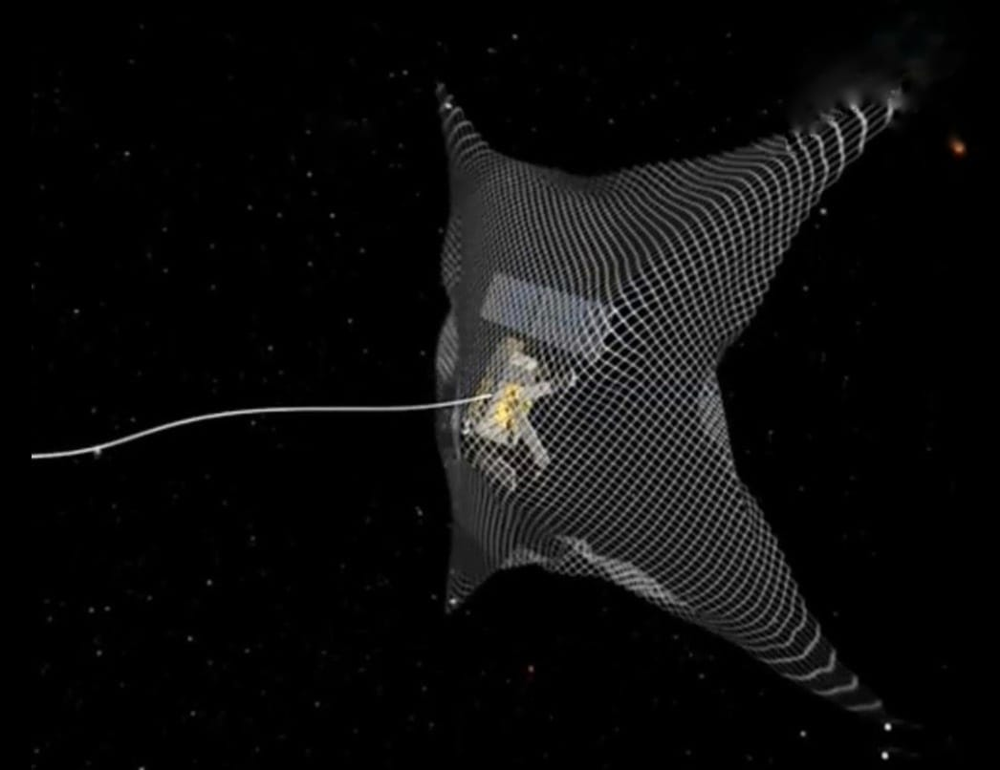

# Space Debris Catcher — Website Guide
## كيفية استخدام الموقع

---

### هيكل الملفات / File Structure

```
space-debris-catcher/
├── index.html          → الصفحة الرئيسية (Home)
├── technology.html     → صفحة التقنية (Technology)
├── simulation.html     → صفحة السيميوليشن (Simulation)
├── gallery.html        → معرض الصور (Gallery)
├── team.html           → صفحة الفريق (Team)
├── style.css           → التصميم (لا تحذفه)
├── main.js             → التفاعلية (لا تحذفه)
├── images/             → ضع صورك هنا
│   ├── net-01.jpg
│   ├── net-02.jpg
│   ├── arm-01.jpg
│   ├── sim-01.jpg
│   ├── sat-01.jpg
│   └── team/
│       ├── member1.jpg
│       └── ...
└── videos/             → ضع فيديوهاتك هنا
    ├── simulation.mp4
    ├── net-simulation.mp4
    ├── arm-simulation.mp4
    ├── ai-detection.mp4
    └── deorbit.mp4
```

---

### خطوات إضافة الصور / How to Add Images

1. أنشئ فولدر اسمه `images` في نفس مكان الـ HTML files
2. ضع صورك بنفس الأسماء المكتوبة في الكود
3. أو غيّر مسارات الصور في الكود لأي أسماء تفضلها

مثال في `gallery.html`:
```html

```
غيّر `net-01.jpg` لاسم ملفك الفعلي.

---

### خطوات إضافة الفيديوهات / How to Add Videos

1. أنشئ فولدر اسمه `videos`
2. ضع فيديوهاتك بنفس الأسماء المكتوبة
3. أو غيّر المسارات في الكود:

في `index.html`:
```html
<source src="videos/simulation.mp4" type="video/mp4"/>
```

---

### تعديل بيانات الفريق / Edit Team Members

افتح `team.html` وغيّر:
- `Team Member 1` → اسم العضو
- `Project Lead` → منصبه
- الوصف في `<p class="member-desc">...</p>`
- صورته في `images/team/member1.jpg`

---

### فتح الموقع / Opening the Website

فقط افتح `index.html` في أي متصفح (Chrome, Firefox, Edge).
لا يحتاج سيرفر — يشتغل مباشرة من الفولدر.

---

### تعديل اسم الفريق

ابحث في جميع الـ HTML files عن:
```
SDC Team
```
وغيّره لاسم فريقك.

---

*Built with HTML, CSS, JavaScript — No frameworks needed*
